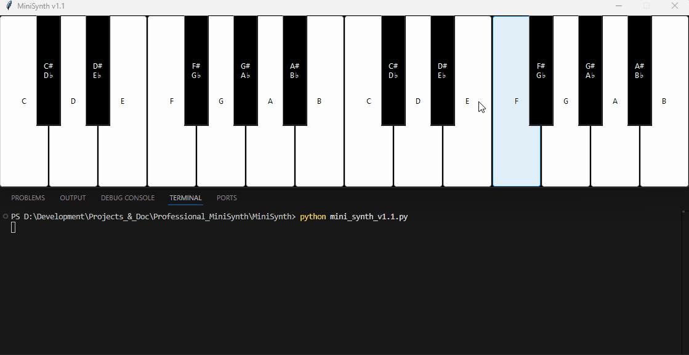

# MiniSynth v1.1


A simple, multi-octave interactive piano keyboard built with Python's Tkinter library. This project serves as a foundational example of GUI development and event handling for audio applications, created as part of a guided career development journey.

---
## Screenshot



---
## 🎹 Features (v1.1)

* A fully interactive, multi-octave piano keyboard GUI.
* Visual feedback for both white keys (themed `ttk` widgets) and black keys (classic `tk` widgets).
* Event handling for each key press, which prints the corresponding note to the console.
* Clean, well-documented, and modular code structure with a professional entry point.

---
## 🛠️ Technologies Used

* **Python 3:** The core programming language.
* **Tkinter / ttk:** For building the graphical user interface.
* **Git & GitHub:** For version control.

---
## 🚀 How to Run

1.  Ensure you have Python 3 installed on your system.
2.  Clone this repository to your local machine:
    ```bash
    git clone [https://github.com/KostasTopouzis/MiniSynth.git](https://github.com/KostasTopouzis/MiniSynth.git)
    ```
3.  Navigate to the project directory:
    ```bash
    cd MiniSynth
    ```
4.  Run the main script:
    ```bash
    python mini_synth_v1.1.py
    ```

---
## 🔜 Future Goals (for v1.1 and beyond)

* Implement a real-time audio engine with PyAudio and NumPy to produce sound.

---
## 🐛 Troubleshooting

### UnicodeEncodeError on Windows

On some Windows systems, the default terminal cannot display special Unicode characters (like the `♭` symbol) and may crash with a `UnicodeEncodeError`. If you encounter this, here are two solutions:

1.  **Run from the Command Line with the UTF-8 flag:**
    Execute the script using this command instead of the standard one:
    ```bash
    python -X utf8 mini_synth_v1.1.py
    ```

2.  **Configure VS Code's Runner (`launch.json`):**
    If you are running the file using the VS Code "Run" button, you can create a `.vscode/launch.json` file in your project with the following content to automatically enable UTF-8 mode for every run:
    ```json
    {
        "version": "0.2.0",
        "configurations": [
            {
                "name": "Python: Current File",
                "type": "python",
                "request": "launch",
                "program": "${file}",
                "console": "integratedTerminal",
                "justMyCode": true,
                "env": {
                    "PYTHONUTF8": "1"
                }
            }
        ]
    }
    ```

---
## 📝 License


This project is distributed under the MIT License. See the `LICENSE` file for the full text and details.

---
## 📫 How to Reach Me

I'm always open to connecting with other developers and musicians or discussing potential collaborations. Please feel free to reach out.

* **Email:** `kostas.topouzis.dev@gmail.com`
