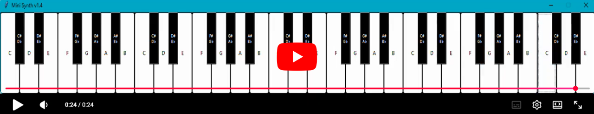

# MiniSynth v1.4

[](https://www.python.org) [](https://numpy.org) [](https://github.com/KostasTopouzis/MiniSynth)

A simple, multi-octave synthesizer built with Python. This version introduces a major architectural upgrade, transforming the synth from monophonic to **polyphonic**. It now features a more sophisticated **ADSR (Attack, Decay, Sustain, Release) envelope** and a refactored object-oriented structure that separates the audio engine from the GUI.

See `CHANGELOG.md` for full release notes — latest: v1.4: Added polyphony, ADSR envelope, and refactored GUI into its own class.

---
## Screenshot

[](https://youtu.be/bQmLWdJsDRM)

---
## Features (v1.4)

* A **polyphonic** audio engine capable of playing multiple notes simultaneously.
* A multi-stage **ADSR (Attack, Decay, Sustain, Release) envelope** for each voice.
* An object-oriented GUI, encapsulated in its own class for better structure.
* Real-time, callback-based audio generation for low latency.
* Thread-safe audio parameter updates using `threading.Lock`.

---

## Technologies Used

* **Python 3:** The core programming language.
* **Tkinter / ttk:** For building the graphical user interface.
* **PyAudio:** For handling the audio stream to the sound card.
* **NumPy:** For generating the sine wave audio data.
* **Git & GitHub:** For version control.

---

## Performance: Vectorization vs. Polyphony

To enable polyphony, where each note requires its own independent envelope state, the audio callback was refactored from a vectorized NumPy approach (used in v1.3.1) to a **per-sample processing loop**. While a per-sample loop is less computationally efficient than a bulk vectorized operation, this change is necessary to manage the complexity of multiple overlapping voices. This represents a classic trade-off between raw performance and advanced features.

To understand the performance difference between these two methods, you can still run the benchmark:

```bash
python benchmarks/benchmark_envelope.py
```

---

## How to Run

1.  Ensure you have Python 3 installed on your system.
2.  Clone this repository to your local machine:
    ```bash
    git clone [https://github.com/KostasTopouzis/MiniSynth.git](https://github.com/KostasTopouzis/MiniSynth.git)
    ```
3.  Navigate to the project directory:
    ```bash
    cd MiniSynth
    ```
4.  Run the main script:
    ```bash
    python mini_synth_v1.4.py
    ```

---
## Future Goals

* **Object-Oriented GUI:** Encapsulate the keyboard creation logic into its own dedicated class.
* **Waveform Selection:** Add the ability to switch between sine, square, and sawtooth waves.
* **Increased control and musical usufulness:** Add the ability to control through the computer keyboard and eventually a MIDI controller.

---
## Troubleshooting

### UnicodeEncodeError on Windows

On some Windows systems, the default terminal cannot display special Unicode characters (like the `♭` symbol) and may crash with a `UnicodeEncodeError`. If you encounter this, here are two solutions:

1.  **Run from the Command Line with the UTF-8 flag:**
    Execute the script using this command instead of the standard one:
    ```bash
    python -X utf8 mini_synth_v1.4.py
    ```

2.  **Configure VS Code's Runner (`launch.json`):**
    If you are running the file using the VS Code "Run" button, you can create a `.vscode/launch.json` file in your project with the following content to automatically enable UTF-8 mode for every run:
    ```json
    {
        "version": "0.2.0",
        "configurations": [
            {
                "name": "Python: Current File",
                "type": "python",
                "request": "launch",
                "program": "${file}",
                "console": "integratedTerminal",
                "justMyCode": true,
                "env": {
                    "PYTHONUTF8": "1"
                }
            }
        ]
    }
    ```

---
## License


This project is distributed under the MIT License. See the `LICENSE` file for the full text and details.

---
## How to Reach Me

I'm always open to connecting with other developers and musicians or discussing potential collaborations. Please feel free to reach out.

* **Email:** `kostas.topouzis.dev@gmail.com`
